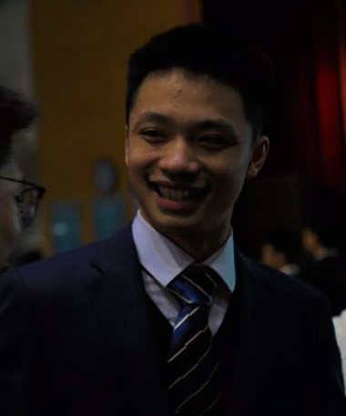

## Merlin Zou - Zou Honggang

### Profile
<div align=center>
  <br>
 Zou Honggang (Merlin Zou) <br>
 Currently as an undergraduate @ University of Chinese Academy of Sciences <br>
</div>
 
`Email` zouhonggang19 [at] gmail.com <br>
`Interests` Computer Vision, Computational Biology <br>
`Address` No.19(A) Yuquan Road, Shijingshan District, Beijing, P.R.China 100049

### Education
<div align=center>
   <br>
   <br>
   <br>
</div>

- 2019.9-2023.7 Undergraduate (CS) @ University of Chinese Academy of Sciences
- 2016.9-2019.7 Senior middle school student @ Beijing National Day School (BNDS)
- 2013.9-2016.7 Junior middle school student @ The High School Affiliated To Beijing Normal University

### Research
```markdown
To be written with the spanning of my life
```

### Selected Publications
```markdown
To be written with the spanning of my life
```

### Awards
```markdown
To be written with the spanning of my life
```

### Experiences
```markdown
To be written with the spanning of my life
```

### Link
[计算技术研究所](http://www.ict.ac.cn/) <br>
[中国科学院大学](https://www.ucas.ac.cn/) <br>
[北京市十一学校](http://www.bnds.cn/) <br>
[北京师范大学附属中学](https://www.bjsdfz.com/)
